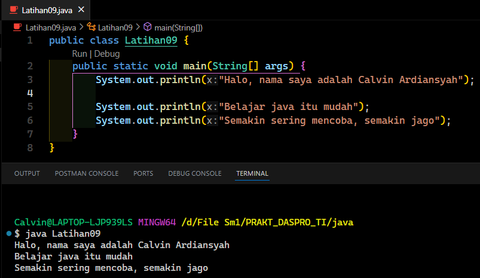
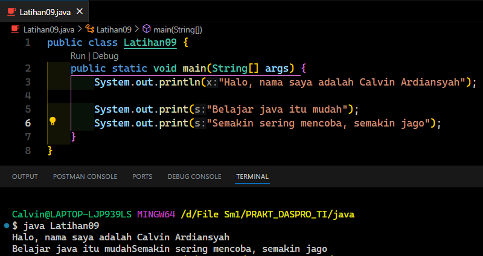
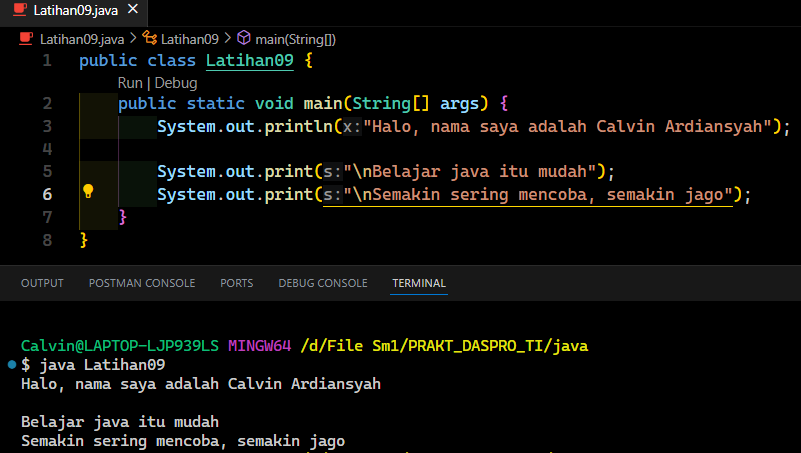
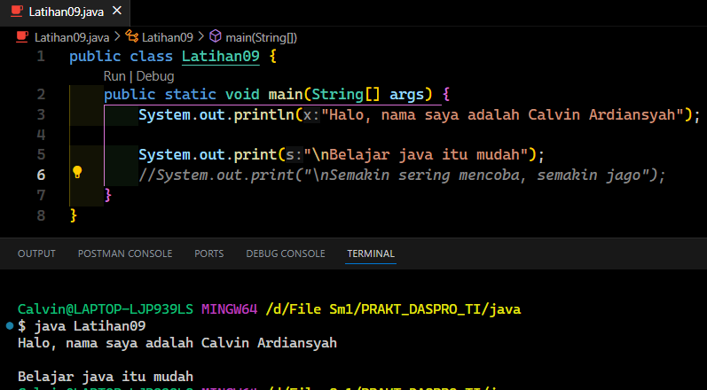
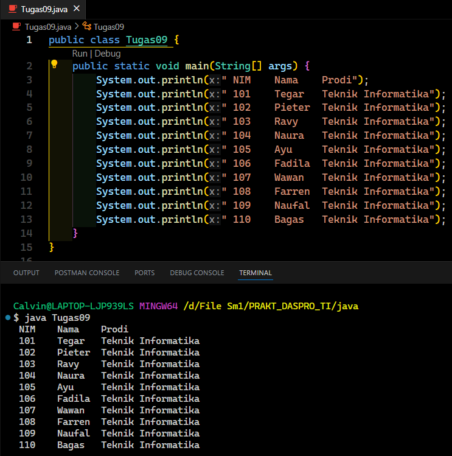

**Pertanyaan 2.1**

1. Jelaskan apa kegunaan memasukkan lokasi folder bin dari Java ke dalam variabel PATH!
- Agar perintah Java bisa dijalankan di command prompt atau terminal vscode.

2. Jelaskan Kegunaan perintah javac ketika masuk di command prompt!
- Untuk mencompile file .java menjadi .claas sehingga file bisa dirunning.

**Pertanyaan 2.2**

1.Jelaskan fungsi perintah javac MyFirstJava00.java pada percobaan diatas!
- Untuk compile file MyFirstJava00.java menjadi MyFirstJava00.class agar kode bisa di running karena jika tidak maka akan terjadi error.

2. Jelaskan fungsi perintah java MyFirstJava00 pada percobaan diatas!
- Untuk running file dengan format .class hasil compile dari file format .java.

**Pertanyaan 2.3**

1. Apakah perbedaan System.out.println("...."); dan System.out.print("...."); Jelaskan!
- Ketika menggunakan println maka teks berikutnya akan berada di baris yang baru jika print teks akan muncul pada satu baris jadi tidak ada enter.

2. Jelaskan fungsi perintah \n pada baris ke 6 dan 7!
- Fungsi \n sama seperti ln pada print yaitu menambahkan enter pada baris teks.

3. Jalankan program dan amati apakah yang terjadi! Jelaskan fungsi karakter //
- Fungsi karakter // sebagai komentar, sehingga baris kode yang diberi fungsi komentar tidak akan terbaca.

/*TUGAS 1*/

Ini adalah program Java sederhana yang menampilkan 10 daftar mahasiswa kelas (Nim, Nama, Prodi) dalam format tabel. Semua data ditulis secara langsung tanpa menginput dari file.

