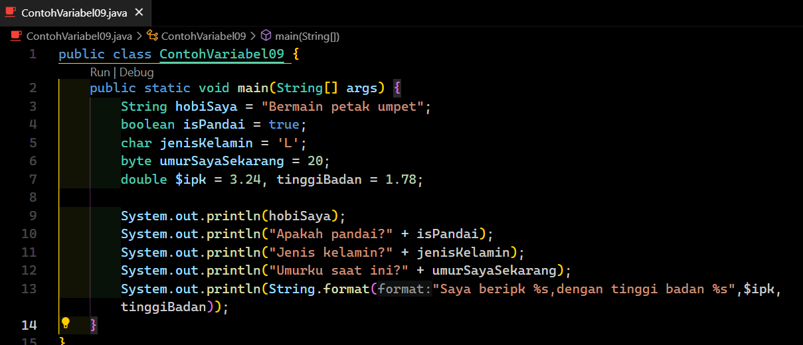
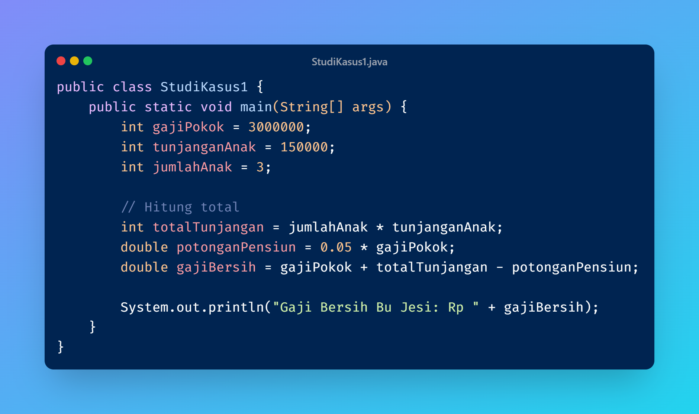
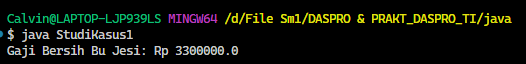
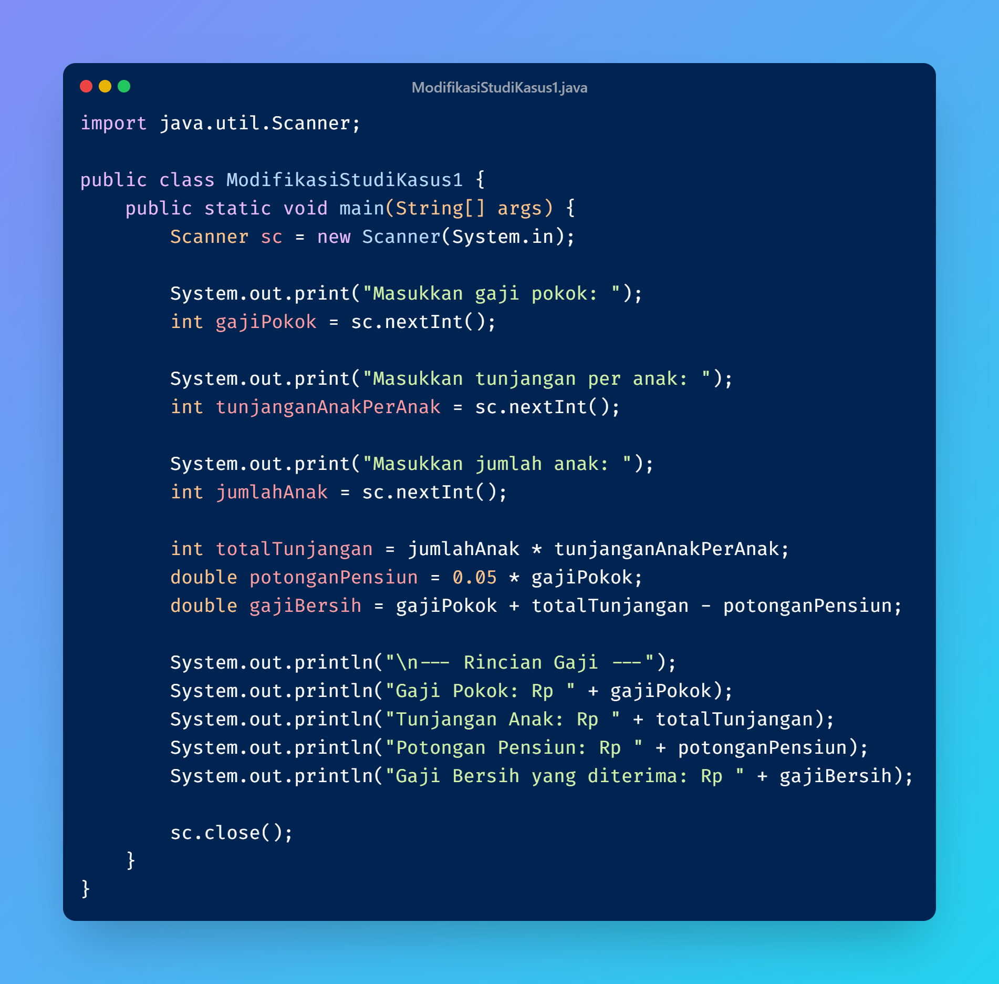
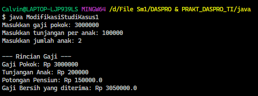
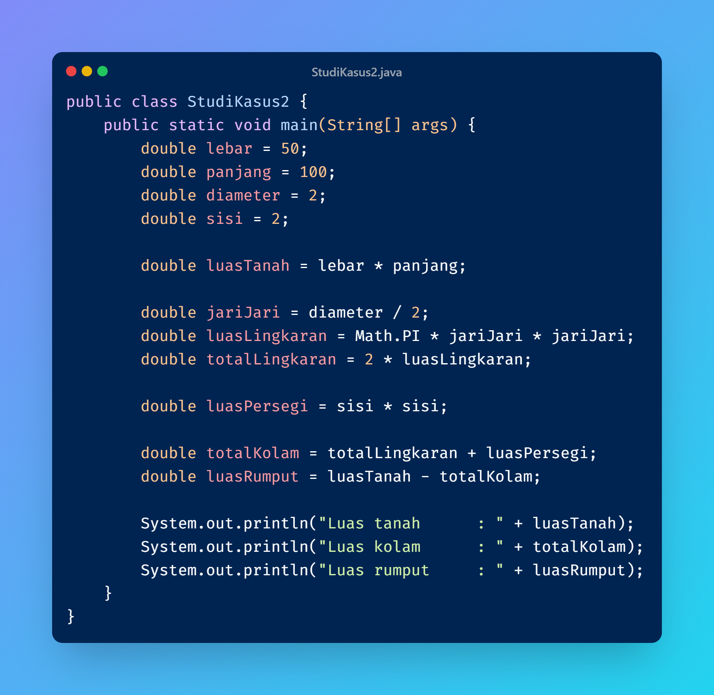
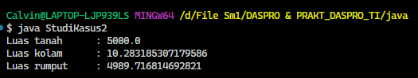
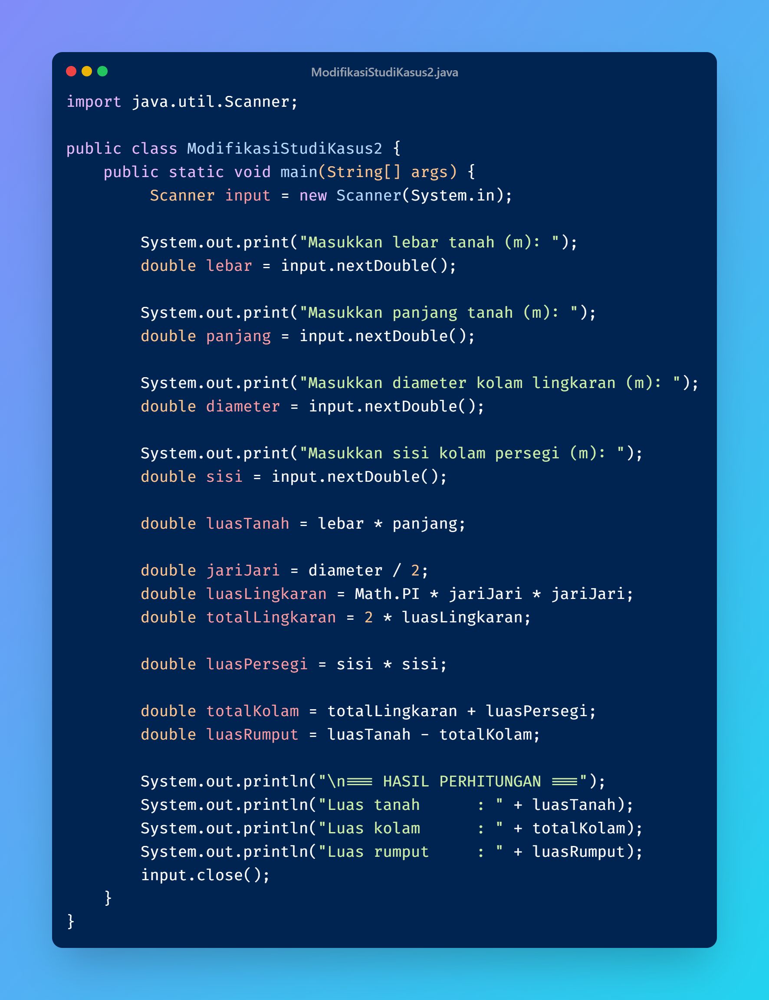
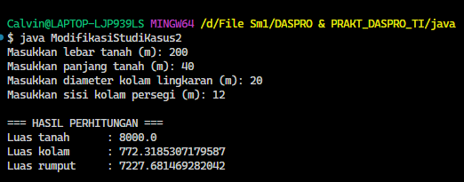

**Pertanyaan 2.1**

1. Silakan Anda ubah nama variabel sehingga model penamaan variabel menjadi baik dan benar!

2. Untuk apakah %s pada statement dibawah ini?
System.out.println(String.format("Saya beripk %s, dengan tinggi badan %s", $ipk, tinggi));
Apakah ada yang bisa digunakan selain %s? Sebut dan jelaskan!
- %s digunakan sebagai placeholder yang akan diisi oleh variable, dalam kode di atas %s pertama diisi oleh $ipk dan %s kedua diisi oleh tinggiBadan. Ada tanda lain yang bisa digunakan selain %s yaitu %d dan %f. Lebih spesifiknya adalah %s (string), %d(integer), %f(pecahan).

**Pertanyaan 2.2**

1. Mengapa ketika menampilkan nilai hasilnya bukan A?
- Karena tipe data char di casting ke byte sehingga menampilkan angka Unicode dari A.

2. Apa maksud sintak byte jarak = (byte) 130? kemudian mengapa ketika ditampilkan hasilnya berubah?
- Maksud dari sintak tersebut adalah nilai variabel 130 tidak bisa disimpan secara langsung karena melebihi dari nilai maksimal byte sehingga harus dilakukan casting agar dapat tersimpan. Tipe data byte memiliki nilai minimal dan maksimal, pada kode di atas nilai pada variabel melebihi maksimal dari byte yaitu 127 sehingga hasilnya menjadi min (-).

3. Pada float suhu = 60.50F; silakan hilangkan F kemudian jalankan kembali. Apa yang terjadi?
- Akan terjadi error karena jika F dihilangkan maka akan menajadi tipe data double sehinggal ditamabah F agar menjadi float.
  
4. Mengapa ketika menampilkan nilai berat, hasilnya berubah?
- Karena tipe data double di casting ke float sehingga angka belakang dibulatkan tidak ditampilkan semua.

5. Maksud inisialisasi 0x10 pada variabel angkaDesimal digunakan untuk apa?
- Untuk menyatakan angka 16 dalam bentuk heksadesimal.

**Pertanyaan 2.3**

1. Jelaskan menurut pendapat Anda perbedaan antara a+b*c dan (a+b)*c?
- Jika a+b*c maka operator * akan didahulukan sedangkan (a+b)*c yang didalam kurung didahulukan.

2. Apakah perbedaan a/b dan a%b!
- Jika a/b merupakan pembagian sedangkan a%b merupakan sisah bagi.

**Pertanyaan 2.4**

1. Jelaskan mengapa harus melakukan deklarasi Scanner di praktikum percobaan 4 diatas?
- Agar library scanner bisa digunakan didalam class.

2. Jelaskan apa kegunaan potongan program dibawah ini!
alas = sc.nextInt();
- Untuk mengambil nilai yang dimasukkan user lalu nilai tersebut disimpan pada variabel alas.

/*TUGAS 2*/

**Studi kasus 1**

**Modifikasi Studi kasus 1**

**Studi kasus 2**

**Modifikasi Studi kasus 2**

