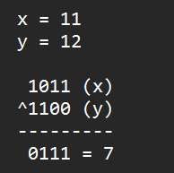
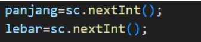
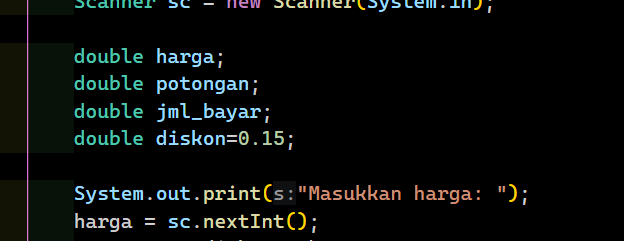
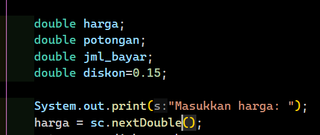
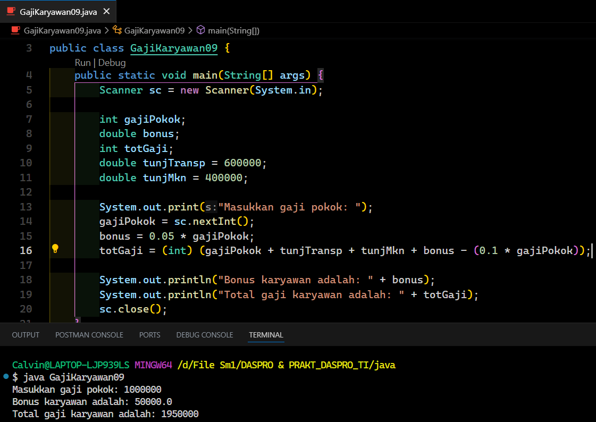
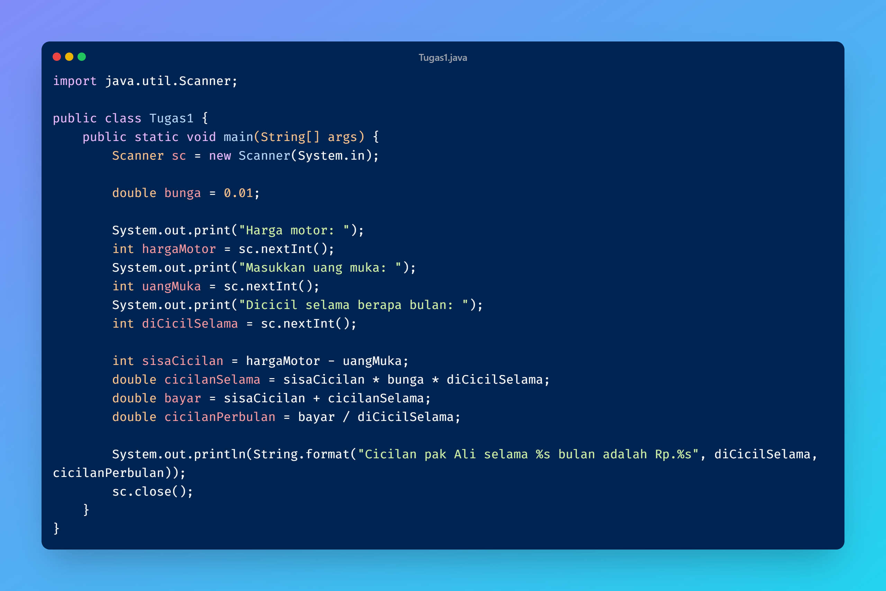
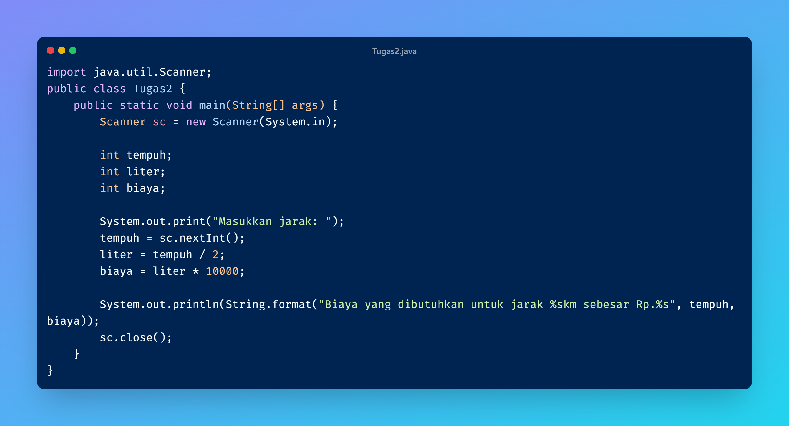

**Pertanyaan 2.1**
1. Jelaskan menurut pendapat Anda perbedaan antara x++ dan ++x?
- Keduanya sebenarnya sama sama menambahkan 1 value dari value sebelumnya,
yang membedakan hanya kapan penambahannya. Jika x++ menambahkan diakhir
dan ++x menambahkan diawal.

2. Berapa hasil dari int z = x ^ y; silakan dilakukan perhitungan secara manual!

**Pernyataan 2.2**
1. Jelaskan mengapa harus melakukan deklarasi Scanner di praktikum percobaan 2 diatas?
- Jika tidak dideklarasi maka akan error dan scanner tidak akan bisa digunakan.

2. Jelaskan apa kegunaan potongan program dibawah ini!

- Program tersebut digunakan untuk menginputkan angka panjang dan lebar
menggunakan util scanner.

**Pertanyaan 2.3**
1. Modifikasi program diatas dengan mengganti tipe data harga menjadi double kemudian
jalankan dan benarkan jika terdapat error sampai program dapat berjalan dengan sesuai
output yang diharapkan.
- Tidak terjadi error jika angka yang diinputkan adalah bilangan bulat sama seperti tipe
data int, tetapi jika menginputkan angka desimal maka akan terjadi error karena pada
scanner masih menggunakan nextInt() sehingga harus diubah menjadi nextDouble().

Error 

No error 

2. Jika pada program diatas dihitung dl jumlah bayar kemudian menghitung potongan, apakah program tetap bisa berjalan sesuai output yang diharapkan? Jelaskan!
- Tetap bisa berjalan karena urutan perhitungan tidak mempengaruhi hasil output.

**Pertanyaan 2.4**
1. Pada potongan program berikut, apakah yang terjadi jika tanda kurung buka dan tutup () dihilangkan dan apakah berpengaruh ke hasil output? Jelaskan!
- Kurung pada (0.1 * gajiPokok) tidak wajib, hanya untuk memperjelas. Kalau dihapus, output tetap sama.

2. Modifikasi program di atas sehingga output total gaji adalah bilangan bulat!

/*TUGAS 3*/

1. 
2. 